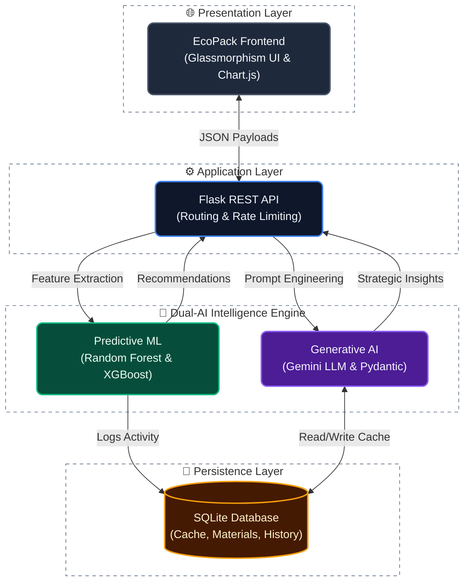

<div align="center">
  
  <h1>EcoPackAI</h1>
  <p><b>Enterprise-Grade AI Sustainability Intelligence Platform for Packaging</b></p>

  [](https://python.org)
  [](https://flask.palletsprojects.com/)
  [](https://sqlite.org/)
  [](https://scikit-learn.org)
  [](https://ai.google.dev/)
</div>

<br/>

EcoPackAI is a full-stack intelligence platform that recommends optimal, eco-friendly packaging materials to businesses. It combines **Machine Learning (Random Forest & XGBoost)** for precise physical suitability predictions with a deeply embedded **Gemini-powered LLM Engine** for strategic sustainability reasoning, compliance checks, and executive summaries.

---

## 📑 Table of Contents

- [Problem Statement](#-problem-statement)
- [Solution Overview](#-solution-overview)
- [Key Features](#-key-features)
- [System Architecture](#-system-architecture)
- [Technology Stack](#-technology-stack)
- [AI Insights Engine](#-ecopack-ai-insights-llm-engine)
- [Installation & Setup](#-installation--setup)
- [API Documentation](#-api-documentation)

---

## ❓ Problem Statement

Traditional packaging in industrial and e-commerce supply chains heavily relies on non-biodegradable and costly materials, causing environmental damage and financial inefficiency. Businesses lack intelligent decision-support systems to evaluate eco-friendly alternatives without compromising durability, product safety, or cost-efficiency.

## 💡 Solution Overview

EcoPackAI solves this challenge by:
1. **Machine Learning**: Analyzing 25 different packaging materials across sustainability metrics to predict the best fit.
2. **Generative AI Insights**: Streaming real-time strategic reasoning, trade-off analysis, and compliance checks via Google Gemini.
3. **Data-Driven Impact**: Comparing current packaging to recommended alternatives to calculate exact CO₂ and financial savings.
4. **Business Intelligence**: Storing recommendation histories in SQLite for BI analytics and tracking.

---

## ✨ Key Features

- 🧠 **Dual-AI Architecture**: Combines traditional predictive ML (Scikit-Learn/XGBoost) with Generative AI (Gemini 1.5).
- 📦 **Comprehensive Material Database**: Analyzes 25 materials across 13 distinct product categories.
- 💬 **EcoPack AI Insights**: Generates automated executive summaries, compliance badges, and sustainability reasoning.
- ⚡ **Real-Time Predictions**: Calculates suitability scores, CO₂ impact, and cost in milliseconds.
- 📊 **BI Dashboard**: Tracks key performance indicators (KPIs), charts, and insights on environmental impact.
- 💾 **Smart Caching**: SQLite-backed LLM caching layer to minimize API latency and token costs.

---

## 🏗️ System Architecture



---

## 🛠️ Technology Stack

| Component | Technology |
|-----------|------------|
| **Frontend** | HTML5, CSS3, JavaScript (ES6), Chart.js |
| **Backend API** | Python 3.11, Flask 3.0, Flask-CORS |
| **Database** | SQLite (File-based local DB) |
| **Predictive ML** | scikit-learn 1.3, XGBoost 2.0, pandas, numpy |
| **Generative AI**| `google-genai` SDK, Pydantic (Structured Outputs) |
| **Environment** | `python-dotenv` |

---

## 🧠 EcoPack AI Insights (LLM Engine)

The platform features a deeply embedded LLM engine located at `backend/llm_engine`. Instead of a disconnected chatbot, AI insights are injected directly into the user workflow:

1. **Executive Summaries**: High-level strategic paragraphs outlining the business value of switching materials.
2. **Sustainability Reasoning**: Deep-dive explanations on carbon savings and material trade-offs.
3. **Compliance Engine**: Evaluates materials against global sustainability standards, generating real-time UI badges (e.g., *100% Recyclable*, *Compostable*).
4. **Smart Fallbacks & Caching**: Ensures 100% uptime by falling back to deterministic templates if the API is unreachable, while caching successful hits to save costs.

---

## ⚙️ Installation & Setup

### Prerequisites
- Python 3.10+
- Git

### 1. Clone Repository
```bash
git clone https://github.com/<YOUR_USERNAME>/EcoPackAI.git
cd EcoPackAI
```

### 2. Create Virtual Environment
```bash
python -m venv venv
source venv/bin/activate  # On Windows: .\venv\Scripts\activate
```

### 3. Install Dependencies
```bash
pip install -r requirements.txt
```

### 4. Configure Environment Variables
Create a `.env` file in the root directory:
```env
GEMINI_API_KEY=your_google_gemini_api_key_here
DATABASE_URL=sqlite:///../ecopackai.db
```

### 5. Initialize Database & Run App
```bash
cd backend
python app.py
```

The application will automatically initialize the `ecopackai.db` SQLite database with standard materials and categories on first boot.

Open your browser and navigate to: **`http://127.0.0.1:5000`**

---

## 📡 API Documentation

EcoPackAI exposes several REST endpoints for system integration:

| Method | Endpoint | Description |
|--------|----------|-------------|
| `POST` | `/api/recommend` | Runs the ML models to predict the top packaging materials. |
| `POST` | `/api/compare` | Compares a user's current material against the recommended alternative. |
| `POST` | `/api/ai/explain` | Triggers Gemini to generate sustainability reasoning. |
| `POST` | `/api/ai/summary` | Triggers Gemini to write an executive summary. |
| `POST` | `/api/ai/compliance` | Triggers Gemini to analyze compliance rules. |
| `GET`  | `/api/analytics/summary`| Retrieves KPIs for the BI Dashboard. |

*Note: AI endpoints expect JSON payloads containing product category, weight, and the ML-recommended material.*

---

<p align="center">
  <b>Built with 💚 for a sustainable future</b>
</p>